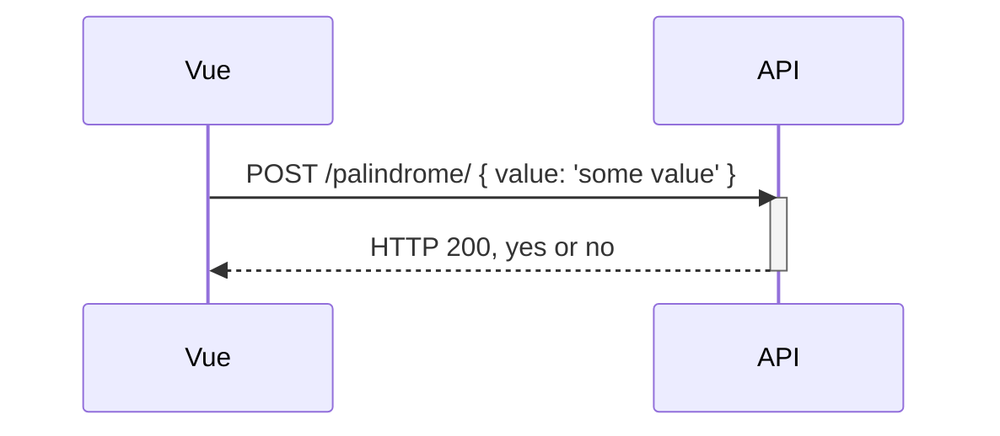

# Coding Exercise - Vue to ASPNET Core

This repo contains the coding exercise for working with Vue and ASPNET Core.

## Details - Palindrome SPA to API

This exercise will have two parts - one is the Vue frontend. At a high level, the Vue application will
display a text box to the user that lets them type in words or sentences. Next to the text box, there
will be a button. When clicking the button, the Vue app will make an API call to the ASPNET Core API.
The ASPNET Core API will provide a single API call to evaluate if the word or sentence is a palindrome.
The frontend will append each result tried into an HTML table.

The Vue app will display results like so:

| Results                   | Is Palindrome?   |
| ------------------------- | ---------------- |
| Test                      | Not a palindrome |
| Mr. Owl Ate My Metal Worm | Is a palindrome  |
| dude                      | Not a palindrome |
| dood                      | Is a palindrome  |

### Feature - Frontend Vue SPA

See [/frontend/](./frontend/) for scaffolded code.

- [ ] Add a new Vue route and page
- [ ] New page should have a simple form with a text box and button
- [ ] Should POST to API and display if the input is a palindrome or not
- [ ] Should keep track of all results in an HTML table as above
  - no need to remember results
- [ ] Add a link to the new route from the generated Vue CLI home page

### Feature - ASPNET Core API Backend

See [/backend/](./backend/) for scaffolded code.

- [ ] Add a POST API endpoint for the frontend to call
- [ ] Implement the palindrome logic in the palindrome service
- [ ] Ensure the palindrome service can handle palindromes correctly
- [ ] Ensure basic palindromes pass
- [ ] Ensure complex sentence palindromes pass
  - Examples
    - Eva, Can I Stab Bats In A Cave?
    - Mr. Owl Ate My Metal Worm
    - A Santa Lived As a Devil At NASA
- [ ] Ensure all existing tests pass
- [ ] Add tests to verify complex sentence palindromes pass

### EXTRA CREDIT Feature - Database and Reloading Support

(if you're unsure if you should work on this part, feel free to ask)

- [ ] Add an EF Core-based database to store the results of each Palindrome
- [ ] Use EF Core migrations to track the schema so that someone else could run it
- [ ] Ensure that the frontend code renders the latest Palindrome results on load
- [ ] Use SQL Server or Postgres for the database (recommended to use Docker for the database)

## Submission

Please create a branch and submit a pull request with your changes.

## Resources and Notes

Please follow industry best practices for your submission. See also [our coding guidelines](coding-guidelines.md).

See below for some good code review tips as well:

- <https://www.devart.com/review-assistant/code-review-guidelines-net-developers.html#code-review-best-practices>
- <https://dev.to/designpuddle/code-review-checklist-14ke>
- <https://www.slideshare.net/alokkumarpandey/code-review-guidelines-77459250/19>
